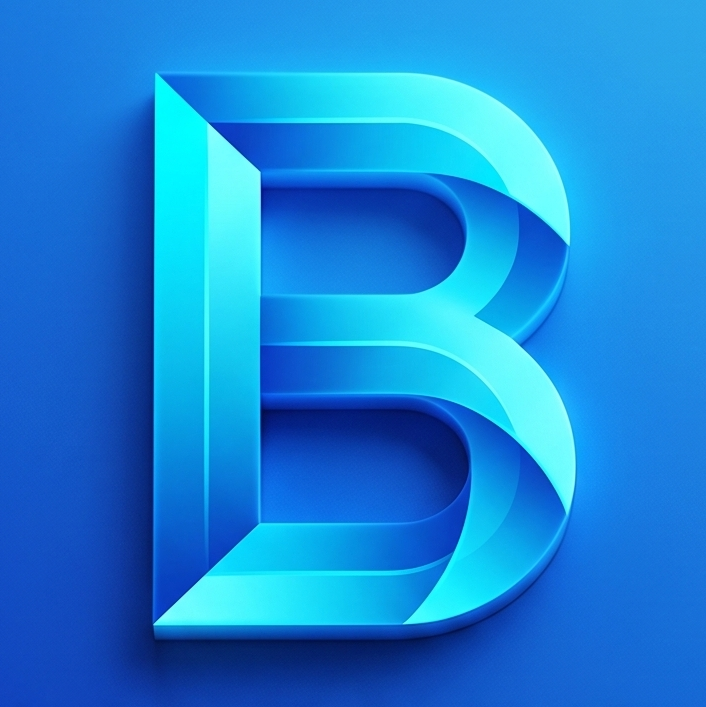

  
# BolashaqApp

### Smart preparation for the UNT

**Closed Beta**

Flutter • Android • Supabase

---

## About

BolashaqApp is a modern Android application designed to help students prepare for the Unified National Testing (UNT).

The project focuses on fast performance, a clean interface and an extensive database of practice questions.

> Source code is private during the beta stage.
> This repository serves as the official public showcase of the project.

---

## Features

- Modern Material Design interface
- Large UNT question database
- Mathematics rendering support
- Detailed test statistics
- Fast and lightweight experience
- Continuous updates

---

## Project Status

| Status | Value |
|---------|-------|
| Stage | Closed Beta |
| Platform | Android |
| Framework | Flutter |
| Backend | Supabase |

---

## Screenshots

Screenshots will be added soon.

---

## Demo

Demo video coming soon.

---

## Roadmap

See **docs/ROADMAP.md**

---

## Changelog

See **docs/CHANGELOG.md**

---

## FAQ

See **docs/FAQ.md**

---

## Contact

GitHub Issues will be used for bug reports and feedback.

---

© BolashaqApp
