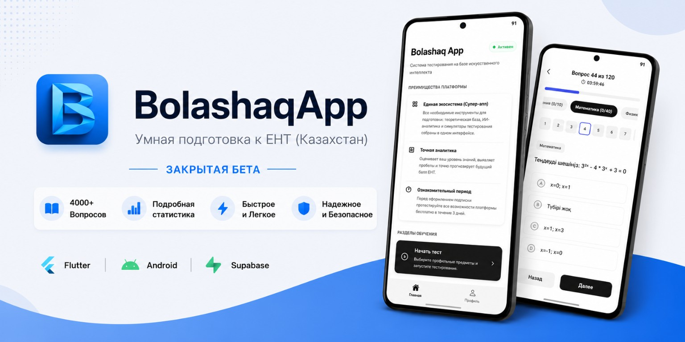
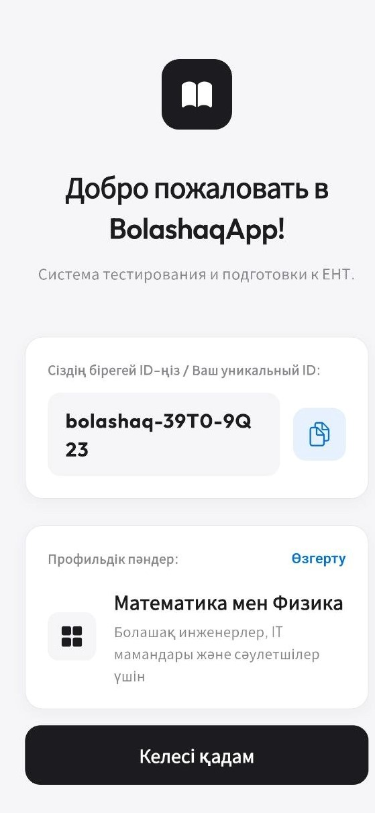
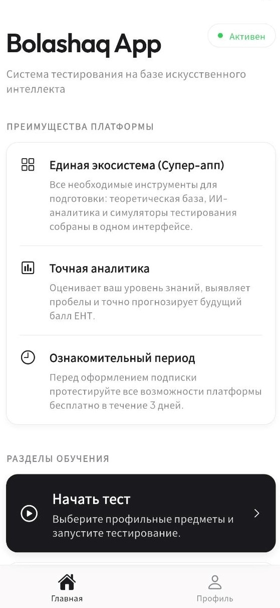
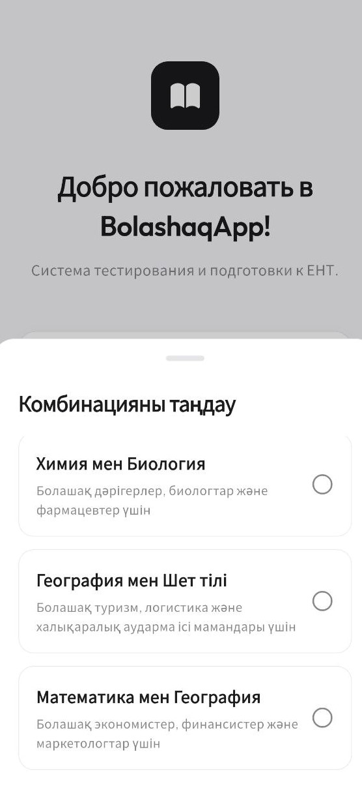
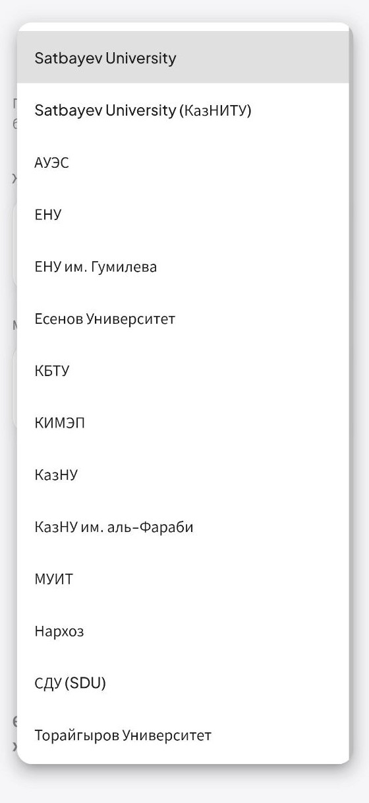
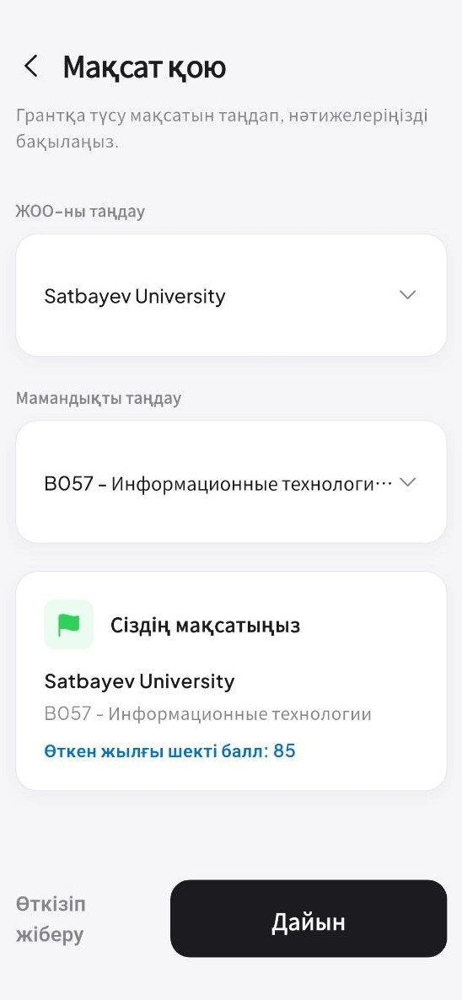
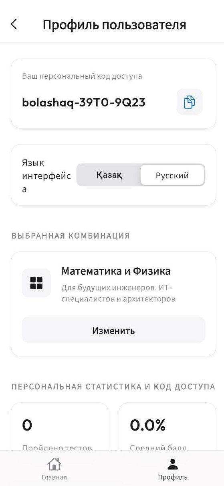
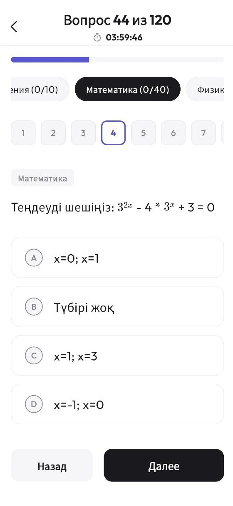
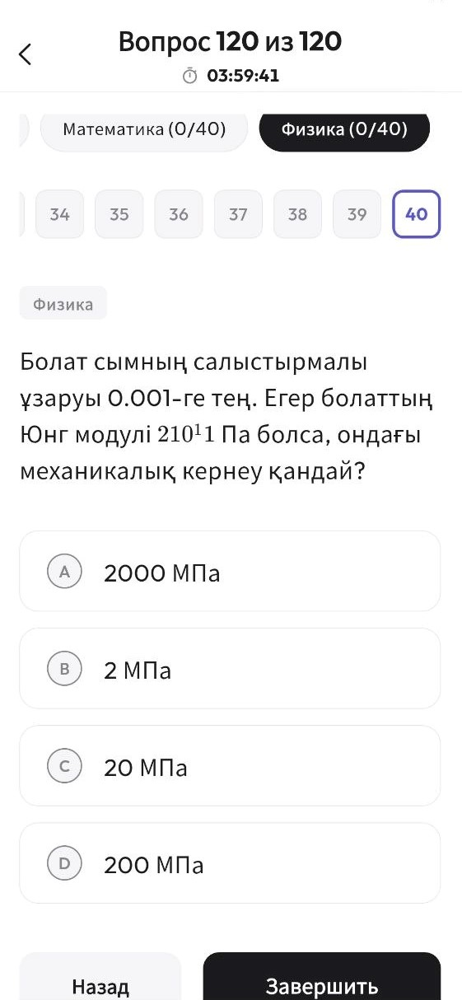
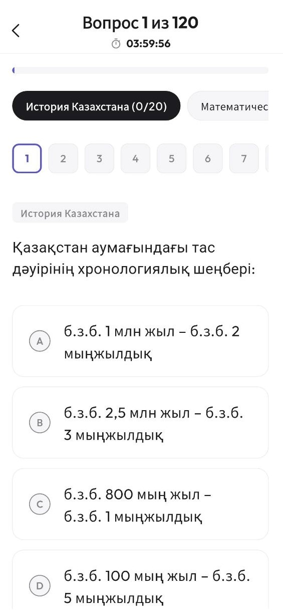

  
  
# BolashaqApp

# О проекте

BolashaqApp — интеллектуальная образовательная платформа для подготовки к ЕНТ, объединяющая тестирование, искусственный интеллект, аналитику и персонализированное обучение в одном приложении.

Проект находится на стадии закрытого бета-тестирования.

---

# Что умеет BolashaqApp
## 📱 Скриншоты

### Добро пожаловать

### Главный экран

### Выбор комбинации предметов

### Подбор университетов

### Грант-радар

### Профиль

### Тест по математике

### Тест по физике

### Тест по истории

### 🤖 ИИ-помощник

Искусственный интеллект помогает разбирать ошибки, объяснять темы и сопровождать процесс подготовки.

### 📊 Умная аналитика

Подробная статистика по каждому предмету, выявление слабых мест и рекомендации для дальнейшего обучения.

### 📝 Полноценное тестирование

Полноформатные пробные экзамены ЕНТ с таймером, системой оценки и детальной статистикой.

### 📚 Большая база вопросов

Более 4000 вопросов с регулярным пополнением.

### 🎯 Персонализированная подготовка

Обучение строится на основе результатов пользователя и его прогресса.

### ⚡ Современный интерфейс

Минималистичный дизайн, высокая скорость работы и удобная навигация.

---

# Статус проекта

🟢 Закрытая бета

В настоящее время приложение проходит тестирование перед публичным запуском.

---

# Дорожная карта

- ✅ Закрытая бета
- 🚧 Расширение базы вопросов
- 🚧 Развитие ИИ-помощника
- ⏳ Публичный релиз
- ⏳ Публикация в Google Play

---

# Исходный код

Исходный код проекта является приватным.

Данный репозиторий создан как официальная публичная витрина проекта, где публикуются новости разработки, дорожная карта, скриншоты и релизы.
